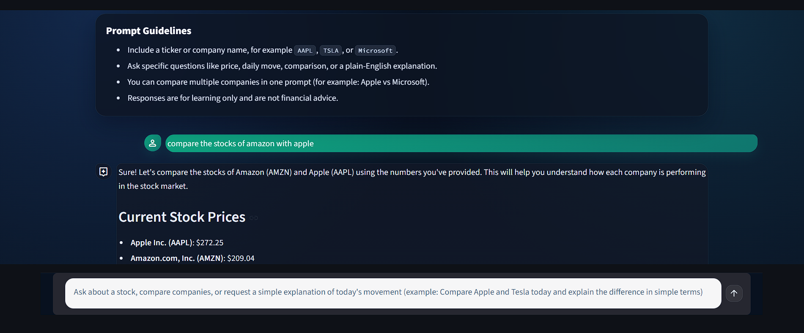

# Stock Data AI Assistant

An AI-powered stock assistant with both a CLI and a Streamlit web frontend. It fetches real stock data and explains it in clear, simple language. This project is designed for learning: how to ingest market data, parse user questions, and generate grounded explanations.


## Objectives
- Provide a simple conversational interface for stock questions.
- Fetch real market data without a paid market-data API.
- Translate numeric market data into plain-language explanations.
- Support multi-company comparisons.
- Support both terminal and web-based usage.
- Keep the project educational, transparent, and safe.

## Requirements
- Python 3.9+
- Internet access (for market data and AI calls)
- One of:
  - GitHub Models token (`GIT_ACCESS_TOKEN`), or
  - OpenAI API key (`OPENAI_API_KEY`)

## Setup
1. Install dependencies:
```bash
cd stock-ai-assistant
pip install -r requirements.txt
```

2. Create a `.env` file and add credentials:
```
GIT_ACCESS_TOKEN=your-github-models-token
```

Optional (GitHub Models config):
```
GITHUB_MODELS_BASE_URL=https://models.github.ai/inference
GITHUB_MODELS_MODEL=openai/gpt-4o-mini
```

Optional (OpenAI fallback):
```
OPENAI_API_KEY=your-openai-key
OPENAI_MODEL=gpt-4o-mini
OPENAI_BASE_URL=
```

Notes:
- The app uses an OpenAI-compatible client and supports both GitHub Models and OpenAI.
- The default configured models are:
  - GitHub Models: `openai/gpt-4o-mini`
  - OpenAI: `gpt-4o-mini`
- You can change the model using `GITHUB_MODELS_MODEL` or `OPENAI_MODEL`.

## Streamlit Frontend
The project includes a Streamlit-based web frontend (`app.py`) with a chat-style interface.

Features:
- Chat-style prompt and response UI
- Prompt guidelines on the home screen
- `See Companies` button to view supported companies (Top 50 USA + Top 50 India)
- AI explanation with fallback to raw stock summary if AI call fails

Run the Streamlit app:
```bash
cd stock-ai-assistant
python -m streamlit run app.py
```

If `streamlit` is not recognized in PowerShell, use `python -m streamlit ...` as shown above.

## Usage
### CLI App
Run the terminal assistant:
```bash
cd stock-ai-assistant
python stock_assistant.py
```

Ask questions like:
- "What's the price of AAPL?"
- "How is TSLA doing today?"
- "Compare Microsoft and Google"
- "Tell me about Reliance Industries"

## How It Works
1. Parse your question to detect company names and ticker symbols.
2. Fetch live data from Yahoo Finance via `yfinance`.
3. Generate an explanation using a configurable AI model (GitHub Models or OpenAI).
4. Present a clean summary with key metrics.

## Supported Symbols
The parser recognizes standard tickers and company names and includes a built-in supported list of:
- Top 50 USA companies (by market cap)
- Top 50 India companies (by market cap)

Total built-in supported companies: **100**

The parser also supports direct ticker input (including common Yahoo Finance formats like `BRK-B` and `.NS` / `.BO` symbols).

Examples:

US (examples)
- AAPL = Apple
- MSFT = Microsoft
- GOOGL = Alphabet (Google)
- TSLA = Tesla
- AMZN = Amazon
- META = Meta (Facebook)

India (examples from supported list)
- RELIANCE.NS = Reliance Industries
- HDB = HDFC Bank
- BHARTIARTL.NS = Bharti Airtel
- SBIN.NS = State Bank of India
- IBN = ICICI Bank
- TCS.NS = Tata Consultancy Services
- BAJFINANCE.NS = Bajaj Finance
- LT.NS = Larsen & Toubro
- HINDUNILVR.NS = Hindustan Unilever
- LICI.NS = Life Insurance Corporation of India
- INFY = Infosys
- MARUTI.NS = Maruti Suzuki
- M&M.NS = Mahindra & Mahindra
- KOTAKBANK.NS = Kotak Mahindra Bank
- AXISBANK.BO = Axis Bank
- SUNPHARMA.NS = Sun Pharmaceutical
- HCLTECH.NS = HCL Technologies
- ITC.NS = ITC
- ULTRACEMCO.NS = UltraTech Cement
- TITAN.NS = Titan Company

Note: Some entries use ADR or BSE symbols (e.g., `HDB`, `IBN`, `AXISBANK.BO`) because those are commonly used by Yahoo Finance data.

## Project Structure
- `app.py`: Streamlit web frontend (chat-style UI)
- `streamlit_app.py`: Earlier Streamlit frontend version (optional/alternate)
- `stock_assistant.py`: CLI entry point
- `config.py`: Environment config and validation
- `ai_service.py`: AI client and prompt logic
- `data_service.py`: `yfinance` data fetching
- `parsing.py`: Symbol extraction, alias mapping, and supported company list (100 companies)
- `formatting.py`: Summary formatting
- `models.py`: Data models
- `requirements.txt`: Python dependencies
- `.env`: API keys (create locally)

## Future Improvements
- Add `.NS` / `.BO` suffix normalization for Indian tickers.
- Support ETFs, indices, and crypto.
- Add charting and technical indicators.
- Include news and sentiment context.
- Add unit tests for parsing and data formatting.

## Open Contributions
Contributions are welcome. If you want to help:
- Open an issue describing the problem or feature.
- Submit a PR with a clear description and test notes.
- Keep changes focused and well-documented.

## Footnotes
1. Supported company list (Top 50 USA + Top 50 India) is based on market-cap rankings from CompaniesMarketCap (snapshot used on Feb 24, 2026). See:
   - USA: https://companiesmarketcap.com/usa/largest-companies-in-the-usa-by-market-cap/
   - India: https://companiesmarketcap.com/india/largest-companies-in-india-by-market-cap/inr/

## Disclaimer
This project is for educational purposes only. It is not financial advice.
